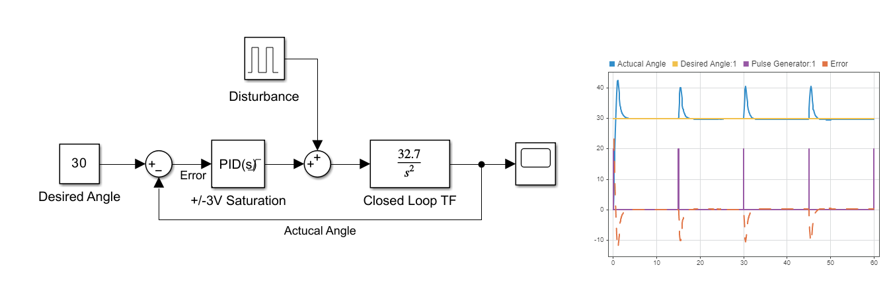

# PID Balance Beam
A project to explore control theory, using the Laplace domain and PID control.

## The Model
- A vertical beam, connected to a horizontal beam via a bearing and rotary potentiometer.
- A brushed dc motor sits on one end of the horizontal beam.
- The horizontal beam is positioned such that there is no net moments around the pivot (except the motor)
- This is all wired up to a STM32F446RET6 Nucleo board

## The Theory
All the derivations and assumptions can be found in the [Theory.md](Theory.md) file.

The short version: linearising the thrust/voltage relationship about the hover voltage
leaves a double integrator, so the open loop plant is

```math
G(s) = a/s^2, \quad a = 2kV_0/mx \approx 32.7
```

A plant with both poles at the origin has no natural damping, so proportional control alone
will oscillate forever — derivative action is what makes the loop stable here.

## Simulation
A simple MatLab Simulink script has been drawn out to simulate the reactions using assumed values,
as well as a basic MatLab script for some simple plots for stability.



The model closes the loop around `32.7/s²` with a PID block, saturated to ±3 V to represent the
usable range either side of the 3 V hover point. A pulse generator injects a disturbance so the
rejection behaviour can be seen.

**Behaviour (right hand scope):** the beam is commanded to 30°. It overshoots to roughly 42° on the
initial step before settling, and each disturbance pulse produces a similar transient that is driven
back to the setpoint within a few seconds. Steady state error is zero.

### Stability
[Stability_Plots.m](Stability_Plots.m) builds the same open loop and plots the pole-zero map, root
locus and gain/phase margins for the tuned gains:

| Gain | Value |
| --- | --- |
| Kp | 50 |
| Ki | 0 |
| Kd | 10 |

Ki is left at zero in the stability script — the plant already integrates twice, so there is no
steady state error to remove and adding integral action only pushes the loop closer to instability.

## Firmware
The STM32CubeMX project lives in [Code_STM32/PID_Balance_STM32F446RE_Nucleo/](Code_STM32/PID_Balance_STM32F446RE_Nucleo/),
with the control loop in [Core/Src/main.c](Code_STM32/PID_Balance_STM32F446RE_Nucleo/Core/Src/main.c).

| Peripheral | Use |
| --- | --- |
| ADC1, channel 0 (PA0), 12-bit | Reads the rotary potentiometer |
| TIM1, channel 1 (PA8), 10 kHz | PWM drive to the motor |
| USART2 | Debug output |

The loop is a straightforward read → compute → actuate:

1. Poll ADC1 and map the 0–4095 count across the potentiometer's 0–270° travel.
2. Run the PID against a reference of 135° (the midpoint of the pot's travel), timing `dt` from `HAL_GetTick()`.
3. Clamp the PID output to ±3 V and map that onto the 0–6 V motor range as a 0–999 compare value,
   so 0 V of correction sits at 50% duty.

Gains are set in the `PIDController` struct at the top of `main()`, matching the simulated values
(Kp = 50, Kd = 10, with a small Ki = 0.1 on hardware to trim out real world offsets the model ignores).

## Repository contents
| File | Description |
| --- | --- |
| [Theory.md](Theory.md) | Derivation of the plant model and open loop transfer function |
| [PID_Balancer.slx](PID_Balancer.slx) | Simulink closed loop model |
| [simulink_model.png](simulink_model.png) | Screenshot of the model and scope output |
| [Stability_Plots.m](Stability_Plots.m) | Pole-zero, root locus and margin plots |
| [Code_STM32/](Code_STM32/) | STM32CubeMX project and firmware |
